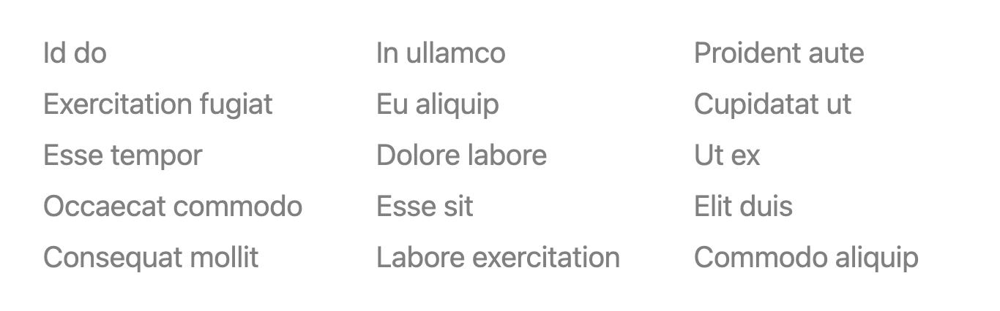

Repeat elements inside HTML pages using a simple attribute.

## Examples

### Footer Navigation

```html
<div class="grid gap-1" data-repeat="3">
  <a
    href="#"
    data-repeat="5"
    data-words="2"
    class="transition hover:opacity-100 opacity-50"
  ></a>
</div>
```

<p align="center">
    
</p>
